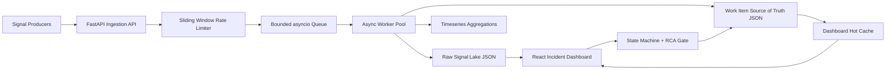

# Incident Management System

A compact mission-critical IMS implementation for high-volume signal ingestion, debounce-based incident creation, workflow management, RCA validation, and a responsive operations dashboard.

## Architecture



## Tech Stack

- Backend: Python, FastAPI, Pydantic, asyncio.
- Frontend: React, Vite, lucide-react.
- Storage: file-backed JSON adapters that represent the data lake and transactional source of truth. These can be replaced by S3/OpenSearch, PostgreSQL, Redis, and ClickHouse/Timescale in production.
- Deployment: Docker Compose.

## Backpressure

The ingestion API writes accepted signals to a bounded `asyncio.Queue`. If persistence slows down and the queue reaches `QUEUE_MAX_SIZE`, the API returns `503` so clients can retry with exponential backoff instead of crashing the process. A sliding-window rate limiter protects the ingestion edge from cascading failure. Console metrics print every five seconds with current signals/sec and queue depth.

## Debouncing

Signals are grouped by `component_id`. If repeated signals for the same component arrive within ten seconds of the first signal, the worker links them to the existing work item and stores every raw payload in the raw signal lake. This satisfies the requirement that 100 signals for `CACHE_CLUSTER_01` create one work item while retaining all 100 signal records.

## Workflow Rules

Valid state transitions:

```text
OPEN -> INVESTIGATING -> RESOLVED -> CLOSED
RESOLVED -> INVESTIGATING
```

Closing requires a complete RCA with incident start/end, category, fix applied, and prevention steps. MTTR is calculated from the first signal time to the RCA incident end time.

## Run With Docker Compose

```bash
docker compose up --build
```

Open:

- Frontend: http://localhost:5173
- Backend health: http://localhost:8000/health
- API docs: http://localhost:8000/docs

## Replay Sample Failure

After the stack is running:

```bash
python sample-data/replay_failure.py --repeat 25
```

This sends an RDBMS outage, MCP host failure, and cache degradation into the ingestion API.

## Local Backend

```bash
cd backend
python -m venv .venv
.venv\Scripts\activate
pip install -r requirements.txt
uvicorn app.main:app --reload
```

## Local Frontend

```bash
cd frontend
npm install
npm run dev
```

## Tests

```bash
cd backend
pytest
```

## Repository Contents

- `backend/app`: API, services, workflow, storage adapters, models.
- `backend/tests`: RCA and debounce tests.
- `frontend/src`: React dashboard.
- `sample-data`: replay script and mock failure payloads.
- `docs/IMPLEMENTATION_PLAN.md`: implementation notes and prompt/spec trail.
