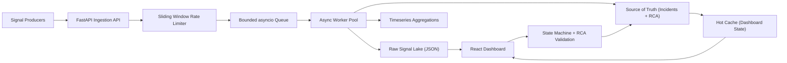

# 🚀 Incident Management System (IMS)

A **production-inspired, mission-critical Incident Management System** designed to handle high-volume signal ingestion, intelligent incident creation, and workflow-driven resolution with mandatory Root Cause Analysis (RCA).

Modern distributed systems generate massive volumes of signals (errors, latency spikes, failures). Without proper aggregation and workflow, this leads to alert fatigue and delayed recovery. This system addresses that by implementing **debouncing, async processing, and structured incident lifecycle management**.

---

# 🧠 Architecture



---

# ⚙️ Tech Stack

### Backend
- Python + FastAPI → async, high-throughput ingestion
- asyncio Queue + Worker Pool → lightweight concurrency model

### Frontend
- React + Vite → responsive dashboard

### Storage (Simulated Production Design)

| Layer | Implementation | Production Equivalent |
|------|--------------|----------------------|
| Raw Signal Lake | JSON | S3 / OpenSearch |
| Source of Truth | JSON | PostgreSQL |
| Cache | In-memory | Redis |
| Aggregations | Counters | ClickHouse / Timescale |

### Deployment
- Docker Compose

---

# 🧱 System Design Decisions

- FastAPI → async-first, ideal for high throughput  
- asyncio Queue → enables backpressure handling  
- File-based storage → simple abstraction, replaceable with real infra  
- Worker Pool → parallel processing without race conditions  

---

# ⚡ Key Features

## High Throughput Ingestion
- Handles burst traffic using async API
- Designed for scalability (10k signals/sec conceptually)

---

## Backpressure Handling
- Uses bounded queue  
- If queue is full:
  - API returns 503  
  - Clients retry with backoff  

---

## Rate Limiting
- Sliding window algorithm  
- Protects ingestion layer from overload  

---

## Debouncing Logic

- Signals grouped by `component_id`  
- Time window: 10 seconds  

Example:
```
100 signals → 1 incident
```

- All signals stored in raw data lake  
- Only one work item created  

---

## Concurrency Model

- Async ingestion via FastAPI  
- Queue buffering  
- Worker pool processing  
- Prevents race conditions  

---

## Workflow Engine

### State Pattern
```
OPEN → INVESTIGATING → RESOLVED → CLOSED
RESOLVED → INVESTIGATING
```

---

## RCA Enforcement
- Cannot close incident without RCA  
- RCA includes:
  - Start & End time  
  - Root cause  
  - Fix  
  - Prevention  

---

## MTTR Calculation
```
MTTR = RCA end_time - first_signal_time
```

---

## Alerting Strategy
- P0 → critical alerts  
- P2 → standard alerts  

---

## Observability
- `/health` endpoint  
- Logs:
  - Signals/sec  
  - Queue depth  

---

# 🖥️ Frontend Dashboard

- Live incident feed  
- Incident detail view  
- RCA form  

---

# 🧪 Sample Failure Simulation

```bash
python sample-data/replay_failure.py --repeat 25
```

Simulates:
- RDBMS outage  
- Cache failure  
- MCP host failure  

---

# 🐳 Run with Docker

```bash
docker compose up --build
```

Access:
- Frontend → http://localhost:5173  
- Backend → http://localhost:8000  
- API Docs → http://localhost:8000/docs  
- Health → http://localhost:8000/health  

---

# 💻 Local Setup

## Backend
```bash
cd backend
python -m venv .venv
.venv\Scripts\activate
pip install -r requirements.txt
uvicorn app.main:app --reload
```

## Frontend
```bash
cd frontend
npm install
npm run dev
```

---

# 🧪 Tests

```bash
cd backend
pytest
```

---

# 📂 Repository Structure

```
/backend
/frontend
/sample-data
/docs
docker-compose.yml
README.md
```

---

# ✅ Assignment Mapping

| Requirement | Implementation |
|------------|--------------|
| High throughput | Async API + queue |
| Debouncing | Component window |
| Async processing | Worker pool |
| RCA enforcement | Workflow validation |
| MTTR | Calculated |
| Rate limiting | Sliding window |
| Backpressure | Queue + 503 |
| Observability | Health + metrics |
| UI | React dashboard |
| Sample data | Replay script |

---

# 🚀 Future Improvements

- Replace JSON with PostgreSQL, Redis, S3  
- Add JWT authentication  
- Real alerting (email/SMS)  
- Kafka/RabbitMQ integration  

---

# 🎯 Summary

This project demonstrates:
- Distributed system design  
- SRE workflow understanding  
- Scalable backend architecture  
- DevOps best practices  
